**Vue**

[toc]

# 官方文档：
v2:https://v2.cn.vuejs.org/
v3:https://cn.vuejs.org/
# 1. Vue简介
1. Vue用于构建用户界面的渐进式的框架


2. Vue API 风格


3. Vue 特点
1. 采用组件化模式，提高代码复用率，且让代码更好维护

2. 声明式编码，让编码人员无需直接操作DOM，提高效率


3. 使用虚拟DOM+优秀的Diff算法，尽量复用DOM节点


4. 在线Vue2链接
```js
<script src="https://cdn.jsdelivr.net/npm/vue@2.7.16/dist/vue.js"></script>
```

**未在Vue应用中启用DevTools：您需要在Vue应用中启用DevTools。在浏览器控制台中输入Vue.config.devtools = true，这将启用DevTools。**


## 创建一个Vue实例

```html
 <!-- 创建Vue实例的步骤 -->
  <!-- 1.准备一个容器 -->
  <div class="box1"></div>
  <div class="box2"></div>

  <div id="app">
    <!-- 这是准备的容器，这里将来会编写一些用于渲染的逻辑代码 -->
     <!-- 通过差值表达式来拿到值 -->
    {{msg}}
  </div>

  <!-- 2.引包 -->
  <script src="../vue.js"></script>
  <!-- <script src="https://cdn.jsdelivr.net/npm/vue@2.7.16/dist/vue.js"></script> -->
  <script>
    // 一旦引入了VueJS核心包，在全局环境下，就有了Vue构造函数
    // 3. 通过构造函数实例化对象
    const app = new Vue({
      // 通过el配置选择器，指定VUE管理的是那个盒子
      el: '#app',
      // 通过data提供数据
      data: {
        msg: 'hello World,在线的包不能用了，所以得用下载的'
      }
    })
  </script>

```

## 插值表达式`{{}}`
>插值表达式是Vue的一种模版语法，
>作用：利用 表达式 进行插值渲染
>表达式是可以被求值的代码
>语法：{{表达式}}

```html
<!-- 1.准备容器 -->
  <div id="app">
    <!-- 4.使用插值表达式 绑定数据 -->
    <!-- {{表达式}} -->
    <p>{{ninkName}}</p>
    <p>{{ninkName.toUpperCase()}}</p>
    <p>{{ninkName + ' hello'}}</p>
    <p>{{ninkName.age > 18  ? '成年' : '未成年'  }}</p>
    <p>{{friend.name}}</p>
    <p>{{friend.hobby}}</p>

    <!-- ----------------------- -->
    <!-- 错误案例 -->
    <!-- <p>{{ des }}</p> -->
    <!-- <p>{{ if }}</p> -->
    <!-- <p title="{{ nickname }}">我是p标签</p> -->
  </div>
  <!-- 2.导包 -->
  <script src="../vue.js"></script>
  <script>
    // 3.创建Vue实例
    const app = new Vue({
      // 两个核心配置项
      el: '#app',
      data: {
        ninkName: 'finn',
        age: 16,
        friend: {
          name: 'jack',
          hobby: 'adventure'
        }
      }
    })
  </script>
```

## 响应式特性
>响应式：当数据发生变化时，视图会自动更新
>优点：简化了视图的更新逻辑，让开发者专注于业务逻辑的实现


- 访问数据： 实例.属性名

- 修改数据： 实例.属性名 = 值


## 安装Vue开发者工具：装插件调试Vue应用
直接在edge浏览器上安装即可
或者在chrome浏览器上安装


# 2.Vue指令
带有前缀`v-`的属性，叫做Vue指令
## v-html:设置元素的innerHTML
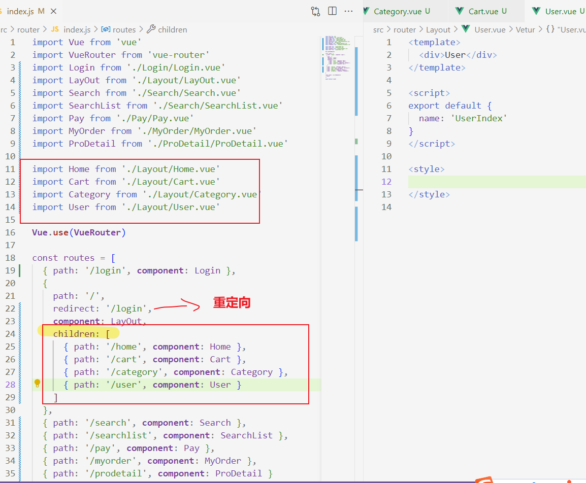


## v-show和v-if


## v-else和v-else-if

```html
<div id="app">
    <p v-if="gender === 1">性别：♀ 女</p>
    <p v-else>性别：♂ 男</p>
    <hr>
    <p v-if="score >= 90 ">成绩评定A：奖励电脑一台</p>
    <p v-else-if="score >= 70 ">成绩评定B：奖励周末郊游</p>
    <p v-else-if="score >= 60 ">成绩评定C：奖励零食礼包</p>
    <p v-else>成绩评定D：惩罚一周不能玩手机</p>
  </div>

  <script src="/vue.js"></script>
  <script>
    const app = new Vue({
      el: '#app',
      data: {
        gender: 1,
        score: 80
      }
    })
  </script>
```

## v-on
>v-on:事件监听
v-on:click="表达式"
v-on: => @


#### 语法1(v-on-内联语句)：点击按钮实现数字加减
```html
  <div id="app">
    <button @click="count--">-</button>
    <span>{{count}}</span>
    <button @click="count++">+</button>
  </div>
  <script src="https://cdn.jsdelivr.net/npm/vue@2.7.16/dist/vue.js"></script>
  <script>
    const app = new Vue({
      el: '#app',
      data: {
        count: 100
      }
    })
  </script>
```

#### 语法2（v-on-methods函数）：点击按钮实现文字的显示与隐藏

```html
  <div id="app">
    <button @click="fn">切换显示隐藏</button>
    <h1 v-show="show">黑马程序员</h1>
  </div>
  <script src="./vue.js"></script>
  <script>
    const app = new Vue({
      el: '#app',
      data: {
        show: true
      },
      methods: {
        fn() {
          // 进行取反操作
          // mothods函数中的所有this都指向当前实例
          // app.show = !app.show
          this.show = !this.show
        }
      }
    })
  </script>
```

#### v-on-参数传递

```html
<div id="app">
    <div class="box">
      <h3>小黑自动售货机</h3>
      <button @click="buy(5)">可乐5元</button>
      <button @click="buy(10)">咖啡10元</button>
    </div>
    <p>银行卡余额：{{money}}元</p>
  </div>

  <script src="/vue.js"></script>
  <script>
    const app = new Vue({
      el: '#app',
      data: {
        money: 100
      },
      methods: {
        buy(price) {
          this.money -= price
        }
      }

    })
  </script>
```

## v-bind


```html
<div id="app">
    
    <!-- 简写 -->
    
  </div>
  <script src="./vue.js"></script>
  <script>
    const app = new Vue({
      el: '#app',
      data: {
        img: "imgs/10-01.png",
        title: '小猴子'
      }
    })
  </script>
```

#### 吗喽学习案例

```html
<div id="app">
    <button v-show="index > 0" @click="index--">上一页</button>
    <div>
      
    </div>
    <button v-show="index < list.length - 1" @click="index++">下一页</button>
  </div>
  <script src="./vue.js"></script>
  <script>
    const app = new Vue({
      el: '#app',
      data: {
        index: 0,
        list: [
          './imgs/11-00.gif',
          './imgs/11-01.gif',
          './imgs/11-02.gif',
          './imgs/11-03.gif',
          './imgs/11-04.png',
          './imgs/11-05.png',
        ]
      }
    })
  </script>
```

## v-for
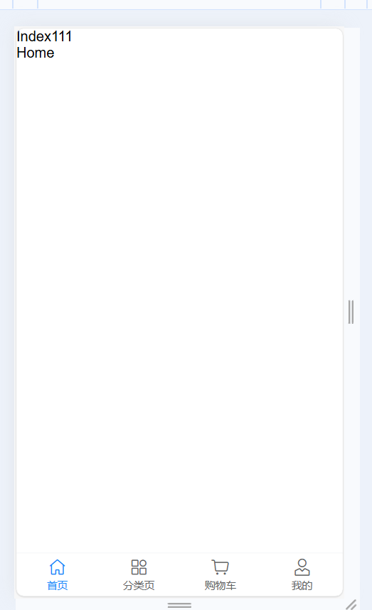


```html
<div id="app">
    <h3>小黑水果店</h3>
    <ul>
      <li v-for="(item, index) in list">{{item}} - {{index}}</li>
      <p>index可省略</p>
      <li v-for="item in list">{{item}}</li>
    </ul>
  </div>

  <script src="./vue.js"></script>
  <script>
    const app = new Vue({
      el: '#app',
      data: {
        list: ['西瓜', '苹果', '鸭梨', '榴莲', '香蕉']
      }
    })
  </script>
```

#### v-for和:key要搭配使用


```html

<div id="app">
    <h3>小黑的书架</h3>
    <ul>
      <!-- ：key="唯一标识"，给列表项添加唯一标识，便于Vue进行列表项的正确排序复用 -->
      <li v-for="(item,index) in booksList" :key="item.id">
        <span>{{item.name}}</span>
        <span>{{item.author}}</span>
        <button @click="del(item.id)">删除</button>
      </li>
    </ul>
  </div>
  <script src="./vue.js"></script>
  <script>
    const app = new Vue({
      el: '#app',
      data: {
        booksList: [{
            id: 1,
            name: '《红楼梦》',
            author: '曹雪芹'
          },
          {
            id: 2,
            name: '《西游记》',
            author: '吴承恩'
          },
          {
            id: 3,
            name: '《水浒传》',
            author: '施耐庵'
          },
          {
            id: 4,
            name: '《三国演义》',
            author: '罗贯中'
          }
        ]
      },
      methods: {
        del(id) {
          // 通过id进行删除数组中的对应项 => filter(生成一个新数组)
          // filter:根据条件，保留满足条件的对应项，得到一个新数组
          this.booksList = this.booksList.filter(item => item.id !== id)
        }
      }
    })
  </script>
```

## v-model


```html
<div id="app">
    账户：<input type="text" v-model="username"> <br><br>
    密码：<input type="password" v-model="password"> <br><br>
    <button @click="login">登录</button>
    <button @click="reset">重置</button>
  </div>
  <script src="/vue.js"></script>
  <script>
    const app = new Vue({
      el: '#app',
      data: {
        username: '',
        password: ''
      },
      methods: {
        login() {
          console.log(this.username, this.password)
        },
        reset() {
          this.username = ''
          this.password = ''
        }
      }
    })
  </script>
```

#### 记事本案例

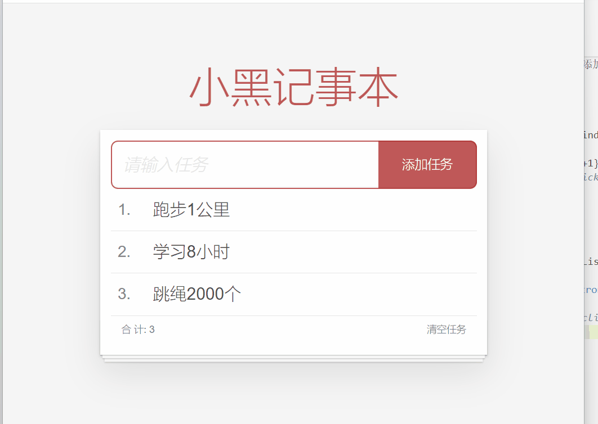
```html
 <!-- 主体区域 -->
  <section id="app">
    <!-- 输入框 -->
    <header class="header">
      <h1>小黑记事本</h1>
      <!-- @keyup.enter="add" 键盘按下enter键执行添加操作 -->
      <input placeholder="请输入任务" class="new-todo" v-model="task" 
      @keyup.enter="add"/>
      <button class="add" @click="add">添加任务</button>
    </header>
    <!-- 列表区域 -->
    <section class="main">
      <ul class="todo-list">
        <li class="todo" v-for="(item, index) in todoList" :key="item.id">
          <div class="view">
            <span class="index">{{index+1}}.</span> <label>{{item.aim}}</label>
            <button class="destroy" @click="del(item.id)"></button>
          </div>
        </li>
      </ul>
    </section>
    <!-- 统计和清空  没任务时不显示-->
    <footer class="footer" v-show="todoList.length > 0">
      <!-- 统计 -->
      <span class="todo-count">合 计:<strong> {{todoList.length}}</strong></span>
      <!-- 清空 -->
      <button class="clear-completed" @click="clear">
        清空任务
      </button>
    </footer>
  </section>

  <!-- 底部 -->
  <script src="/vue.js"></script>
  <script>
    const app = new Vue({
      el: '#app',
      data: {
        task: '',
        todoList: [{
            id: 1,
            aim: '跑步1公里'
          },
          {
            id: 2,
            aim: '学习8小时'
          },
          {
            id: 3,
            aim: '跳绳2000个'
          },
        ]
      },
      methods: {
        add() {
          // trim(): 去除字符串两端的空格
          if (this.task.trim() === '') {
            alert('请输入内容')
            return
          }
          // 这里要添加在最前面
          this.todoList.unshift({
            // 用时间戳表示id???
            id: +new Date(),
            aim: this.task
          })
          // 点击后输入框清空
          this.task = ''
        },
        del(id) {
          this.todoList = this.todoList.filter(item => item.id !== id)
        },
        clear() {
          this.todoList = []
        }

      }
    })
  </script>
```

## 指令修饰符.


## @keyup.enter 键盘回车监听


## v-bind对样式控制的增强

### v-bind操作class


#### 京东秒杀TAB导航高亮案例

```html
<div class="container">
    <ul>
      <!-- 先遍历数组 渲染所有数据 -->
      <!-- 这里 我们用:class来修改样式  样式的修改取决于 lightIndex等于几 即 当前click谁   -->
      <!-- 点击谁拿到谁的下标值 在通过下标值决定active哪个li -->
      <li v-for="(item,index) in list" :key="item.id" :class="{active:index === lightIndex}"
        @click="lightIndex = index">{{item.name}}
      </li>
    </ul>
  </div>
  <!-- 2.导包 -->
  <script src="https://cdn.jsdelivr.net/npm/vue@2.7.16/dist/vue.js"></script>

  <script>
    // 3.创建Vue实例
    const person = new Vue({
      el: '.container',
      data: {
        lightIndex: 0,
        list: [{
            id: 1,
            name: '京东秒杀'
          },
          {
            id: 2,
            name: '每日特价'
          },
          {
            id: 3,
            name: '品类秒杀'
          },
          {
            id: 4,
            name: '新鲜购'
          },
          {
            id: 5,
            name: '小时达'
          }
        ]
      }
    })
  </script>
```
```css
  * {
      padding: 0;
    }

    .container ul {
      height: 60px;
      width: 500px;
      border: 1px solid #ccc;
      border-bottom: 3px solid rgb(119, 82, 83);
    }

    .container li {
      display: inline-block;
      height: 60px;
      line-height: 60px;
      width: 100px;
      text-align: center;
      font-size: 20px;
      font-weight: bold;
      cursor: pointer;
    }

    .active {
      background-color: red;
      color: #fff;
    }
```
### v-bind操作style

**style里面的属性是键值对形式的，值要加''**

#### 进度条控制

```html
 <div class="container">
    <div class="outer">
      <div class="inner" :style="{width:percent+'%'}">
      </div>
    </div>
    <span>{{percent}}%</span>
    <button @click="percent = 25">设置25%</button>
    <button @click="percent = 50">设置50%</button>
    <button @click="percent = 75">设置75%</button>
    <button @click="percent = 100">设置100%</button>
  </div>
  <script src="https://cdn.jsdelivr.net/npm/vue@2.7.16/dist/vue.js"></script>
  <script>
    const container = new Vue({
      el: '.container',
      data: {
        percent: 60
      }
    })
  </script>
```
```css
    * {
      padding: 0;
      box-sizing: border-box;
    }

    .container {
      width: 500px;
      text-align: center;
    }

    .outer {
      height: 25px;
      border: 3px solid #000;
      border-radius: 30px;
      background-color: #000;
    }

    .outer .inner {
      width: 250px;
      height: 20px;
      border: none;
      border-radius: 30px;
      background-color: rgb(64, 158, 255);
      transition: all .3s;
    }

    span {
      display: block;
    }
```

## v-model应用于其他表单元素

```html
<div id="app">
    <h3>小黑学习网</h3>

    姓名：
    <input type="text" v-model="username">
    <br><br>

    是否单身：
    <input type="checkbox" v-model="isSingle">
    <br><br>

    <!-- 
      前置理解：
        1. name:  给单选框加上 name 属性 可以分组 → 同一组互相会互斥
        2. value: 给单选框加上 value 属性，用于提交给后台的数据
      结合 Vue 使用 → v-model
    -->
    性别:
    <input v-model="gender" type="radio" name="gender" value="1">男
    <input v-model="gender" type="radio" name="gender" value="2">女
    <br><br>

    <!-- 
      前置理解：
        1. option 需要设置 value 值，提交给后台
        2. select 的 value 值，关联了选中的 option 的 value 值
      结合 Vue 使用 → v-model
    -->
    所在城市:
    <select v-model="cityId">
      <option value="101">北京</option>
      <option value="102">上海</option>
      <option value="103">成都</option>
      <option value="104">南京</option>
    </select>
    <br><br>

    自我描述：
    <textarea v-model="desc"></textarea>

    <button>立即注册</button>
  </div>
  <script src="https://cdn.jsdelivr.net/npm/vue@2/dist/vue.js"></script>
  <script>
    const app = new Vue({
      el: '#app',
      data: {
        username: '',
        isSingle: true,
        gender: "2",
        cityId: '102',
        desc: ""
      }
    })
  </script>
```
# 3.computed计算属性

```html
<div id="app">
    <h3>小黑的礼物清单</h3>
    <table>
      <tr>
        <th>名字</th>
        <th>数量</th>
      </tr>
      <tr v-for="(item, index) in list" :key="item.id">
        <td>{{ item.name }}</td>
        <td>{{ item.num }}个</td>
      </tr>
    </table>

    <!-- 目标：统计求和，求得礼物总数 -->
    <p>礼物总数：{{totalCount}} 个</p>
  </div>
  <script src="https://cdn.jsdelivr.net/npm/vue@2/dist/vue.js"></script>
  <script>
    const app = new Vue({
      el: '#app',
      data: {
        // 现有的数据
        list: [{
            id: 1,
            name: '篮球',
            num: 1
          },
          {
            id: 2,
            name: '玩具',
            num: 8

          },
          {
            id: 3,
            name: '铅笔',
            num: 5
          },
        ]
      },
      computed: {
        totalCount() {
          return this.list.reduce((pre, curr) => pre + curr.num, 0)
        }
      }
    })
  </script>
```

# 4. computed计算属性 和 methods方法的区别

## computed计算属性：
- 作用：封装了一段对于数据的处理，求得一个结果
- 优点：有缓存特性（提高性能）计算属性会对计算的结果缓存，再次使用时，直接读取缓存，依赖项变化了，会自动重新计算 -> 并再次缓存

- 语法：
1. 写在computed配置项中  
2. 作为属性，直接使用  -> this.计算属性  {{计算属性}}
**计算属性，虽然是属性，但是能修改，但要用计算属性的完整写法：**

## methods方法：
- 作用：封装一段代码，调用以处理业务逻辑
- 语法：
1. 写在methods配置项中
2. 调用：this.方法名() {{方法名（）}} @事件名="方法名"

## computed计算属性完整写法：
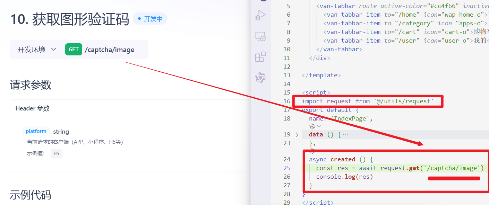
```html
<div class="container">
    <div class="changeName">
      <span>姓名：</span>
      <input v-model="firstName" type="text">
      <span>+名：</span>
      <input v-model="secondName" type="text">
      <span>=</span>
      <span>{{fullName}}</span>
    </div>
    <button @click="changeName()">改名卡</button>
  </div>
  <script src="https://cdn.jsdelivr.net/npm/vue@2.7.16/dist/vue.js"></script>
  <script>
    const container = new Vue({
      el: '.container',
      data: {
        firstName: '李',
        secondName: '倩倩'
      },
      methods: {
        changeName() {
          this.fullName = '祁煜'
        }
      },
      computed: {
        // 1. 当fullName计算属性，被获取求值时，先执行get(有缓存，优先读缓存)
        //    会将返回值作为，求值的结果
        fullName: {
          get() {
            return this.firstName + this.secondName
          },
          // 2. 当fullName计算属性，被修改赋值时，先执行set
          //    修改的值，传递给set方法的形参
          set(value) {
            this.firstName = value.slice(0, 1)
            this.secondName = value.slice(1)
          }
        }

      }
    })
  </script>
```


####  添加成绩数据案例

```html
  <div class="container">
    <div class="table">
      <table>
        <thead>
          <tr>
            <th>编号</th>
            <th>科目</th>
            <th>成绩</th>
            <th>操作</th>
          </tr>
        </thead>
        <tbody v-if="list.length > 0">
          <tr v-for="(item,index) in list" :key="item.id">
            <td>{{index+1}}</td>
            <td>{{item.subject}}</td>
            <!-- 已经忘了... -->
            <td :class="{ red: item.score < 60}">{{item.score}}</td>
            <!-- .prevent 阻止跳转行为 -->
            <td><a href="#" @click.prevent="del(item.id)">删除</a></td>
          </tr>
        </tbody>
        <tbody v-else>
          <tr>
            <td colspan="5" style="height: 120px; color: #bfbdbd;">暂无数据</td>
          </tr>
        </tbody>
        <tfoot>
          <tr v-if="list.length > 0">
            <td colspan="5"><span style="margin-right: 100px;">总分：{{total}}分</span> 平均分：{{avg}}分</td>
          </tr>
        </tfoot>
      </table>
    </div>
    <div class=" setInfo">
      <div class="subject">
        <span>科目：</span>
        <!-- 这里可以直接去掉空格o(╥﹏╥)o -->
        <input v-model.trim="subject" type="text" placeholder="请输入科目">
      </div>
      <div class="score">
        <span>分数：</span>
        <!-- 转数字o(╥﹏╥)o -->
        <input @keyup.enter="add" v-model.number="score" type="text" placeholder="请输入分数">
      </div>
      <button @click="add">添加</button>
    </div>
  </div>
  <script src="https://cdn.jsdelivr.net/npm/vue@2.7.16/dist/vue.js"></script>
  <script>
    const container = new Vue({
      el: '.container',
      data: {
        subject: '',
        score: '',
        list: [{
            id: 1,
            subject: '语文',
            score: 62
          },
          {
            id: 7,
            subject: '数学',
            score: 39
          },
          {
            id: 12,
            subject: '英语',
            score: 70
          },
        ]
      },
      methods: {
        del(id) {
          this.list = this.list.filter(item => item.id !== id)
        },
        add() {
          // if (!this.subject.trim() === '' && !this.score.trim() === '') {

          // } else {
          //   alert('请输入正确信息')
          //   return
          // }
          if (!this.subject) {
            alert('请输入科目')
            this.subject = '',
              this.score = ''
            return
          }
          if (typeof this.score !== 'number') {
            alert('请输入正确的成绩')
            this.subject = '',
              this.score = ''
            return
          }

          this.list.push({
            id: +new Date(),
            subject: this.subject,
            score: +this.score
          })
          this.subject = '',
            this.score = ''
        }
      },
      computed: {
        total() {
          return this.list.reduce((prev, item) => prev + item.score, 0)
        },
        avg() {
          return (this.total / this.list.length).toFixed(2)
        }

      }
    })
  </script>
```
```css
 * {
      padding: 0;
      box-sizing: border-box;
    }

    .container {
      display: flex;
      width: 1300px;
      margin: 50px auto;
    }

    table {
      border-collapse: collapse;
      width: 800px;
      text-align: center;
      /* flex: 4; */
      margin-right: 20px;
    }

    table tr th {
      background-color: #e4dfdf;
    }

    table tr th,
    tr td {
      border: 1px solid #ccc;
      height: 40px;
    }

    .setInfo {
      width: 20%;
      margin-top: 50px;
      /* flex: 1; */
    }

    .setInfo input {
      width: 200px;
      height: 30px;
      text-indent: 5px;
      margin-bottom: 15px;
    }

    button {
      width: 50px;
      background-color: rgb(9, 94, 154);
      color: #fff;
      border: none;
      border-radius: 3px;
      margin-left: 50px;
    }

    .red {
      color: red;
    }
```

# 5. watch监听属性


## 一般变量 写法


## 对象 写法


#### 翻译文本，涉及到ajax请求，需要引入axios库（不了解，，，，，，要去看ajax那个视频,,,,,,）

实时拿到翻译结果
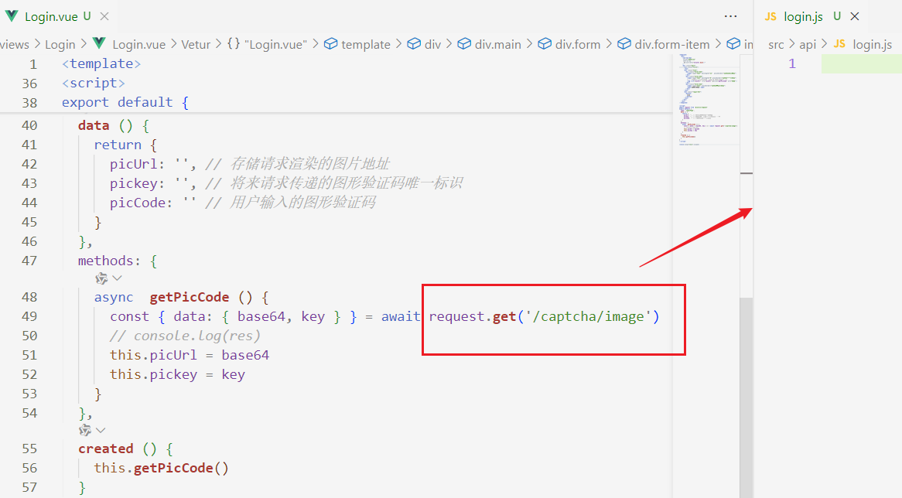
用防抖
```html
 <div id="app">
      <!-- 条件选择框 -->
      <div class="query">
        <span>翻译成的语言：</span>
        <select>
          <option value="italy">意大利</option>
          <option value="english">英语</option>
          <option value="german">德语</option>
        </select>
      </div>

      <!-- 翻译框 -->
      <div class="box">
        <div class="input-wrap">
          <textarea v-model="obj.words"></textarea>
          <span><i>⌨️</i>文档翻译</span>
        </div>
        <div class="output-wrap">
          <div class="transbox">{{ result }}</div>
        </div>
      </div>
    </div>
    <script src="https://cdn.jsdelivr.net/npm/vue@2/dist/vue.js"></script>
    <script src="https://cdn.jsdelivr.net/npm/axios/dist/axios.min.js"></script>
    <script>
      // 接口地址：https://applet-base-api-t.itheima.net/api/translate
      // 请求方式：get
      // 请求参数：
      // （1）words：需要被翻译的文本（必传）
      // （2）lang： 需要被翻译成的语言（可选）默认值-意大利
      // -----------------------------------------------
      
      const app = new Vue({
        el: '#app',
        data: {
          // words: ''
          obj: {
            words: ''
          },
          result: '', // 翻译结果
          // timer: null // 延时器id
        },
        // 具体讲解：(1) watch语法 (2) 具体业务实现
        watch: {
          // 该方法会在数据变化时调用执行
          // newValue新值, oldValue老值（一般不用）
          // words (newValue) {
          //   console.log('变化了', newValue)
          // }

          'obj.words' (newValue) {
            // console.log('变化了', newValue)
            // 防抖: 延迟执行 → 干啥事先等一等，延迟一会，一段时间内没有再次触发，才执行
            // 这里关闭计时器的意思是：只要我们输入有变化，定时器从0开始计时，在0.3s内输入不变了，就发起请求拿到新值。 就是防抖
            clearTimeout(this.timer)
            this.timer = setTimeout(async () => {
              const res = await axios({
                url: 'https://applet-base-api-t.itheima.net/api/translate',
                params: {
                  words: newValue
                }
              })
              this.result = res.data.data
              console.log(res.data.data)
            }, 300)
          }
        }
      })
    </script>
```
## watch完整写法


#### 加入购物车案例

 步骤：
- 渲染列表 v-for

- 删除功能 item.id
- 修改个数 @click="item.num++"
- 全选反选 


- 统计 选中的 总价和 总数量


- 持久化存储到本地 localStorage、 watch 监听数据变化
1. 保存更改的数据

2. 拿到更改的数据

3. 当数据在本地被清空时，更新本地数据


# 6.Vue 核心技术与实战

## 生命周期

### 生命周期的四个阶段

### 生命周期钩子


```html
<div class="app">
    <button @click="count++">+</button>
    <span>{{count}}</span>
    <button @click="count--">-</button>
  </div>
  <script src="https://cdn.jsdelivr.net/npm/vue@2.7.16/dist/vue.js"></script>
  <script>
    const app = new Vue({
      el: '.app',
      data: {
        count: 100
      },
      // 1.创建阶段
      beforeCreate() {
        console.log('beforeCreate', this.count) // undefined
      },
      created() {
        console.log('created', this.count) // 100
      },
      // 2.挂载阶段
      beforeMount() {
        console.log('beforeMount', document.querySelector('span')) //<span>{{count}}</span>
      },
      mounted() {
        console.log('mounted', document.querySelector('span')) // <span>100</span>
      },
      // 3.更新阶段
      beforeUpdate() {
        console.log('beforeUpdate', document.querySelector('span').innerHTML) //beforeUpdate 100
      },

      updated() {
        console.log('updated', document.querySelector('span').innerHTML); // updated 101
      },

      // 4.销毁阶段
      beforeDestroy() {
        console.log('beforeDestroy')
      },
      destroyed() {
        console.log('destroyed')
      }
      
    })
  </script>
```


#### 一进页面 钩子在创建阶段拿到数据并渲染到页面


#### 一进页面 搜索框立即聚焦


#### 小黑记账本

步骤：
- 基本渲染
  1. 先通过axios拿到数据，数据要在钩子初始阶段就加载到页面，所以要放在created钩子中
  先导包
  ```html
    <script src="https://cdn.jsdelivr.net/npm/axios/dist/axios.min.js"></script>
  ```
  
  
  2. 把数据渲染到页面
  
  
  3. 通过计算属性计算总消费
  
  
  
- 添加功能
  1. 先v-model收集表单数据
  
  
  2. 给添加按钮注册点击事件，发送添加请求
  
  
  
  3. 拿到请求结果，把请求结果拼接到原数据中，重新渲染页面 这里要将get请求封装成渲染页面的函数
   
      
      
- 删除功能
  1. 给删除按钮注册点击事件，发送删除请求
  
   
   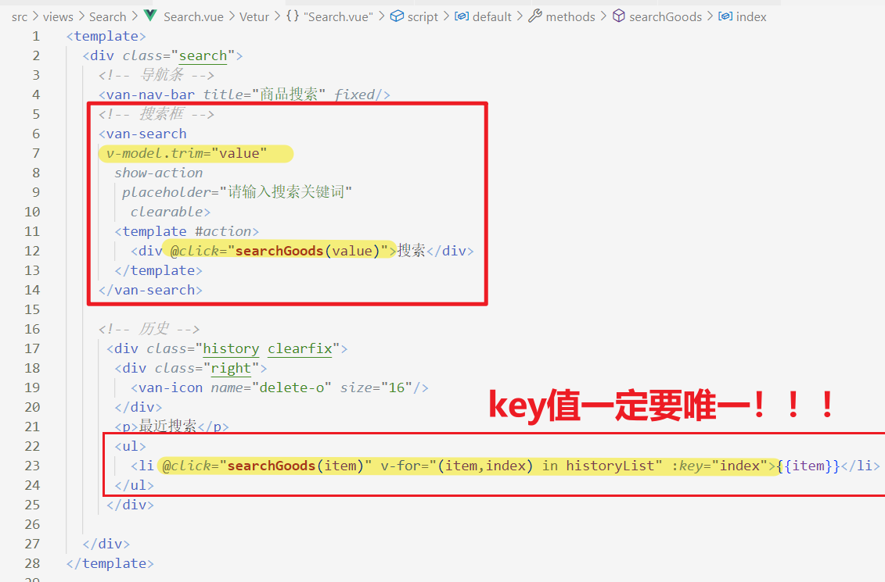
- 饼图渲染  
  网址：https://echarts.apache.org/zh/index.html
  1. 先导包 
  ```html
    <script src="https://cdn.jsdelivr.net/npm/echarts@5.4.0/dist/echarts.min.js"></script>
  ```
  2. 初始化一个饼图
  
  
  2. 把饼图渲染到页面
  
  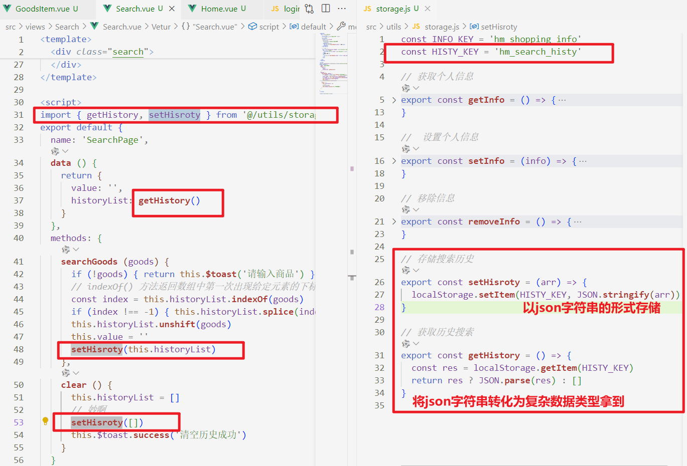
  3.  根据数据实时更新饼图
  更新饼图是在拿到列表数据之后
  
  这里修改数据需要再次调用echarts.setOption()方法，就是上面的重新copy照搬过来，但只需要留下data那项拿来修改就可以了。
  
  但是myChart是mounted（）函数里面的方法，无法直接拿到methods中使用，所以需要将mounted（）函数里的myChart挂载到实例对象app里，
  
  
  
  
```html
<div id="app">
    <div class="contain">
      <!-- 左侧列表 -->
      <div class="list-box">

        <!-- 添加资产 -->
        <form class="my-form">
          <input v-model.trim="name" type="text" class="form-control" placeholder="消费名称" />
          <input v-model.number="coast" type="text" class="form-control" placeholder="消费价格" />
          <button @keyup.enter="add" @click="add" type="button" class="btn btn-primary">添加账单</button>
        </form>

        <table class="table table-hover">
          <thead>
            <tr>
              <th>编号</th>
              <th>消费名称</th>
              <th>消费价格</th>
              <th>操作</th>
            </tr>
          </thead>
          <tbody>
            <tr v-for="(item,index) in list" :key="item.id">
              <td>{{index + 1}}</td>
              <td>{{item.name}}</td>
              <td :class="{red:item.price > 500}">{{item.price.toFixed(2)}}</td>
              <td><a @click="del(item.id)" href="javascript:;">删除</a></td>
            </tr>
          </tbody>
          <tfoot>
            <tr>
              <td colspan="4">消费总计：{{totalPrice.toFixed(2)}}</td>
            </tr>
          </tfoot>
        </table>
      </div>

      <!-- 右侧图表 -->
      <div class="echarts-box" id="main"></div>
    </div>
  </div>
  <script src="https://cdn.jsdelivr.net/npm/echarts@5.4.0/dist/echarts.min.js"></script>
  <script src="https://cdn.jsdelivr.net/npm/vue@2/dist/vue.js"></script>
  <script src="https://cdn.jsdelivr.net/npm/axios/dist/axios.min.js"></script>
  <script>
    /**
     * 接口文档地址：
     * https://www.apifox.cn/apidoc/shared-24459455-ebb1-4fdc-8df8-0aff8dc317a8/api-53371058
     * 
     * 功能需求：
     * 1. 基本渲染
     *    (1) 立刻发送请求获取数据 created
     *    (2) 拿到数据，存到data的响应式数据中
     *    (3) 结合数据，进行渲染 v-for
     *    (4) 消费统计 => 计算属性
     * 2. 添加功能  要将添加的数据加到后台
     *    (1) 收集表单数据 v-model
     *    (2) 给添加按钮注册点击事件，发送添加请求
     *    (3) 需要重新渲染
     * 3. 删除功能
     * 4. 饼图渲染
     */
    const app = new Vue({
      el: '#app',
      data: {
        list: [],
        name: '',
        coast: ''
      },
      created() {
        // 拿到后台数据
        // const res = await axios.get(
        //     'https://applet-base-api-t.itheima.net/bill', {
        //       params: {
        //         creator: '沈星回',
        //         names: '',
        //         coast: ''
        //       }
        //     })
        //   // 把数据给 list
        //   // console.log(res.data.data)
        //   this.list = res.data.data
        this.getList()
      },
      mounted() {
        this.myChart = echarts.init(document.getElementById('main'));
        this.myChart.setOption({
          title: {
            // 标题
            text: '消费账单',
            left: 'center'
          },
          tooltip: {
            trigger: 'item'
          },
          legend: {
            orient: 'vertical',
            left: 'left'
          },
          series: [{
            name: '消费账单',
            type: 'pie',
            radius: '50%',
            data: [],
            emphasis: {
              itemStyle: {
                shadowBlur: 10,
                shadowOffsetX: 0,
                shadowColor: 'rgba(0, 0, 0, 0.5)'
              }
            }
          }]
        })
      },

      methods: {
        // 拿到后台数据封装成函数
        async getList() {
          // 拿到后台数据
          const res = await axios.get(
            'https://applet-base-api-t.itheima.net/bill', {
              params: {
                creator: '沈星回',
                names: '',
                coast: ''
              }
            })
          // 把数据给 list
          // console.log(res.data.data)
          this.list = res.data.data

          // 更新图表
          this.myChart.setOption({

            series: [{
              // name: '消费账单',
              // type: 'pie',
              // radius: '50%',

              // 遍历数组并返回一个新数组  数组里面是对象，对象要用（）包起来不然以为是返回值
              data: this.list.map(item => ({
                value: item.price,
                name: item.name
              }))
            }]
          })
        },
        // 发送添加请求
        async add() {
          if (!this.name) {
            alert('请输入消费名称')
            return
          }
          if (typeof this.coast !== 'number') {
            alert('请输入正确的消费价格')
            this.coast = ''
            return
          }

          const res = await axios.post('https://applet-base-api-t.itheima.net/bill', {
            creator: '沈星回',
            name: this.name,
            price: this.coast
          })
          // 重新渲染
          this.getList()
          this.name = ''
          this.coast = ''
          // console.log(res)
        },

        async del(id) {
          const res = await axios.delete(`https://applet-base-api-t.itheima.net/bill/${id}`)
          // 重新渲染
          this.getList()
        }
      },
      computed: {
        totalPrice() {
          return this.list.reduce((pre, item) => pre + item.price, 0)
        }
      },

    })
  </script>
```


# 7. 工程化开发入门

## 安装脚手架vue cli
1. 用管理员身份打开cmd
2. npm -i @vue/cli -g
3. 查看版本号: vue -V
4. 创建项目：vue create assets-demo
期间会出现一些警告，我这里是权限不够，看这俩博客解决：
https://blog.csdn.net/m0_48276047/article/details/113926266
https://blog.csdn.net/qq_59534189/article/details/131339134

  
  

5. 启动项目
- npm run serve
进入项目目录之后，直接运行：npm run serve

在浏览器复制上面的local地址，打开页面

这里我用vs code的终端无法打开，解决办法：强！


## 在VS code中打开工程项目


## 脚手架目录文件介绍


## 组件化开发&根组件（App.vue）


支持less之前先安装webpack和less
```html
npm install webpack less --save-dev
```
```html
npm install less-loader --save-dev
```


## 普通组件
可以copy src文件，这样昨天的内容可以被保存，但我不需要就直接情况内容重写就好了，src目录下的

**输入`<`直接加载页面结构**

## 组件注册的两种方式
**组件名用大驼峰命名法**
### 局部注册
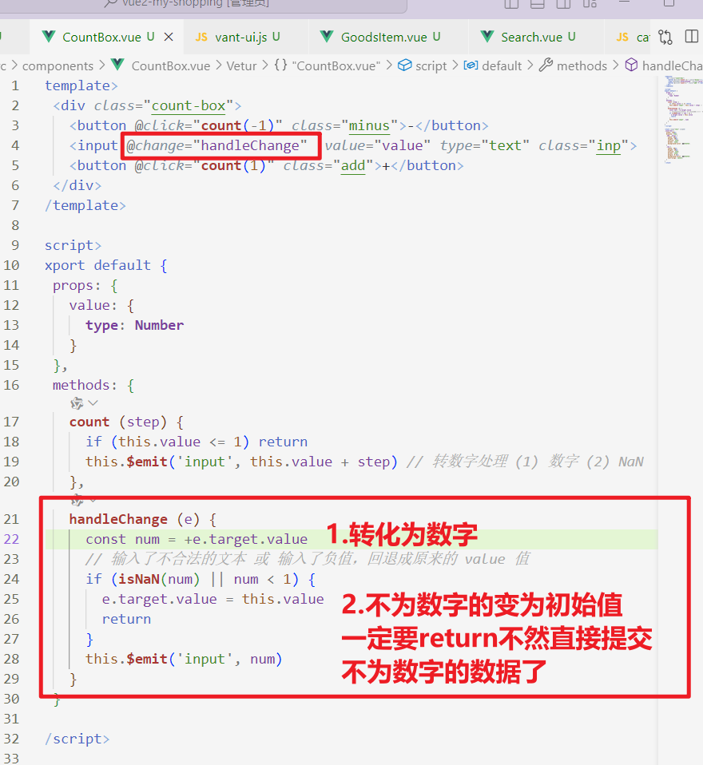


- trigger on tab:实现tab补全组件标签

局部注册步骤：
1. src-新建文件夹components-新建组件文件

2. 编写组件文件的样式，然后在App.vue中引入、注册


3. 使用组件


### 全局注册


全部注册步骤：
1. src-新建文件夹components-新建组件文件

2. 编写组件文件的样式，然后在main.js中注册 

3. 使用组件


#### 小兔鲜首页

**我草！！！！这个快捷键组合套拳一定要学会啊真的好炫酷！！！！**


1. 先把注释拿过来了
- 按滚轮拿到这里的注释

2. 多行单独注释：md一行一行注释吧，多行不行，就成功了一次，，，然后先写一个，再copy需要次数


折叠代码：ctrl+k,ctrl+0
取消折叠：ctrl+k,ctrl+J

步骤：
1. 先改大模块
三步：创建组件文件，注册组件，使用组件

2. 再改小模块

顺便改个名字

搞个全局注册

使用一下


其他同理，这里咱暂时不讲究更换图片啥的，到时候动态请求，就可以

## 组件的三大组成部分（解构/样式/逻辑）


### scoped样式冲突


- 出现元素没有取类名，每个界面的元素样式都会随着当前页面的样式改变而改变
- 默认的style样式，会作用于全局 → 全局样式

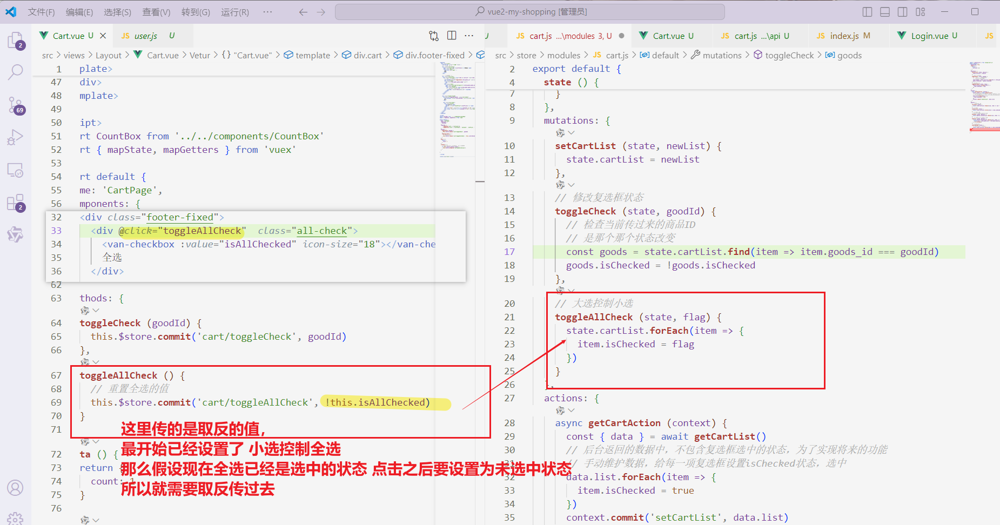

- 使用scoped属性解决，组件之间应该有自己独立的样式，所以推荐使用

### data是一个函数


## 组件通信

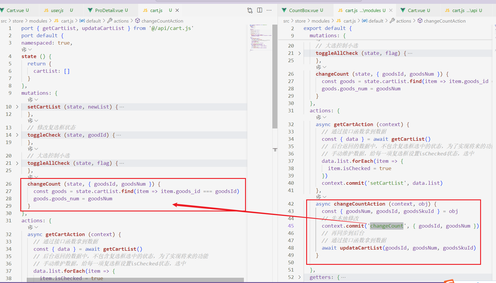


### 父子通信

### 父传子 props


#### 子传父 $emit


### prop:


### props 校验：
- 类型校验（基础）


- 类型校验type、非空校验required、默认值default、自定义校验validator（完整）


### prop & data、单项数据流


##### 小黑记事本组件板
步骤：
**其实就是谁的数据谁处理，子传父，父传子这样找到数据是谁的，清楚子传父，父传子步骤就行**
1. 拆分基础组件


2. 渲染待办任务 （父传子）


3. 添加任务（子传父）


4. 删除任务（子传父）


5. 底部合计（父传子） 和 清空功能（子传父）


6. 持久化存储

watch深度监视list的变化 ， 往本地存 ， 进页面优先读取本地数据


### 非父子通信-event bus


### 非父子通信-provide & inject


## 进阶语法

### v-model

1. v-model原理


2. 表单类组件封装 & v-model简化代码


合一


#### 封装一个简单的输入框

这里 成功了啊 插件就出现了一次所以。。。没截到图

### .sync修饰符


### ref 和 $refs

#### ref 和 $refs获取dom元素

1. 错误示范


2. 使用ref 和 $refs


#### ref 和 $refs获取组件实例

实现父组件远程调用子组件的方法


### Vue异步更新、$nextTick


## 自定义指令


### 全局注册指令
#### v-focus 自定义进入页面获取input焦点的指令


### 局部注册指令


#### v-color 自定义修改dom颜色的指令 


#### v-loading 自定义数据还未加载到页面时的loading效果


注意：


npm install --save axios


## 插槽

### 默认插槽:只能定制一个位置 

#### 修改弹出框中的内容
 

### 插槽的后备内容（默认值）
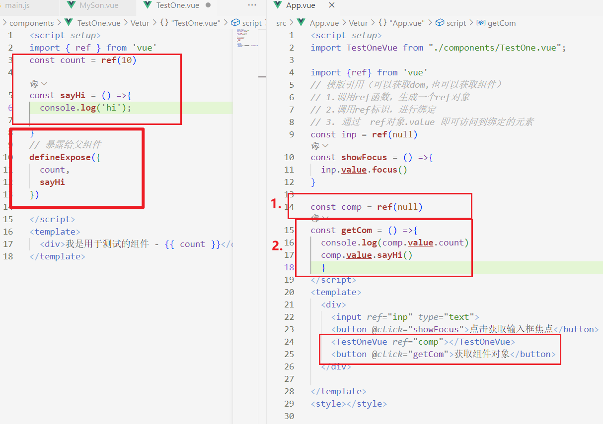

### 具名插槽:定制多个位置 


### 作用域插槽：不是插槽的一种，只是一种属性


#### 商品列表（插槽、v-model）
可以去E:\vueProject\day05\vue2-day5
这个文件里找源码
步骤：
1. 拆分组件（父传子）


2. 实现表头和主体支持用户自定义（插槽）
人话就是，表头可以在App.Vue动态添加/删除/更改数据，表头更改主体跟着一起改

3. 实现my-tag标签组件的封装
- 双击显示输入框，then输入框获取焦点   @dbclick

获取焦点方法1：
获取焦点方法2：
- 失去焦点隐藏输入框 @blur

- 回车显示标签信息，回车更改输入框信息


## 路由入门

### 单页应用程序SPA(single page application)


### Vue中的路由：路径和组件的映射关系


## VueRouter的安装和配置
- 作用：修改地址栏路径是，切换显示匹配的组件
- 官网：https://v3.router.vuejs.org/zh/


### VueRouter的使用（5+2）
基础五步：
1. 下载
>npm add vue-router@3.6.5
2. 引入(以下语句均在main.js中执行)
>import VueRouter from 'vue-router'
3. 安装注册
>Vue.use(VueRouter)
4. 创建路由对象
>const router = new VueRouter()
5. 注入，将路由对象注入到new Vue实例中
```js
new Vue({
  router,
  render: h => h(App),
}).$mount('#app')

```


核心的两步：
**组件名字要取一个单词以上，不然会报错，要用大驼峰命名法。**
1. 在views目录下创建其他需要的组件，配置路由

2. 配置导航配置路由出口


### views文件（存放页面组件）和components文件(存放复用组件)


## 路由进阶

## 封装路由模块


## 链接：声明式导航 router-link


### 声明式导航--实现导航高亮不用js


### 声明式导航--自定义高亮类名（就是把那俩改个名字）


###  声明式导航--跳转传参（查询参数传参）


###  声明式导航--跳转传参（动态路由传参）


### 声明式导航--跳转传参（动态路由传参）--参数可选符


## Vue路由 - 重定向
打开页面，强制跳转到另一个页面


## Vue路由 - 404


## Vue路由 - 模式设置（网址不需要出现#）


## 按钮：编程式导航（通过js）--基本跳转 path路径跳转


### 编程式导航（通过js）--基本跳转 name命名路由跳转


### 编程式导航 - path路径跳转传参 (query传参)


### 编程式导航 - path路径跳转传参 (动态路由传参)


### 编程式导航 - name 命名路由跳转传参 (query传参)
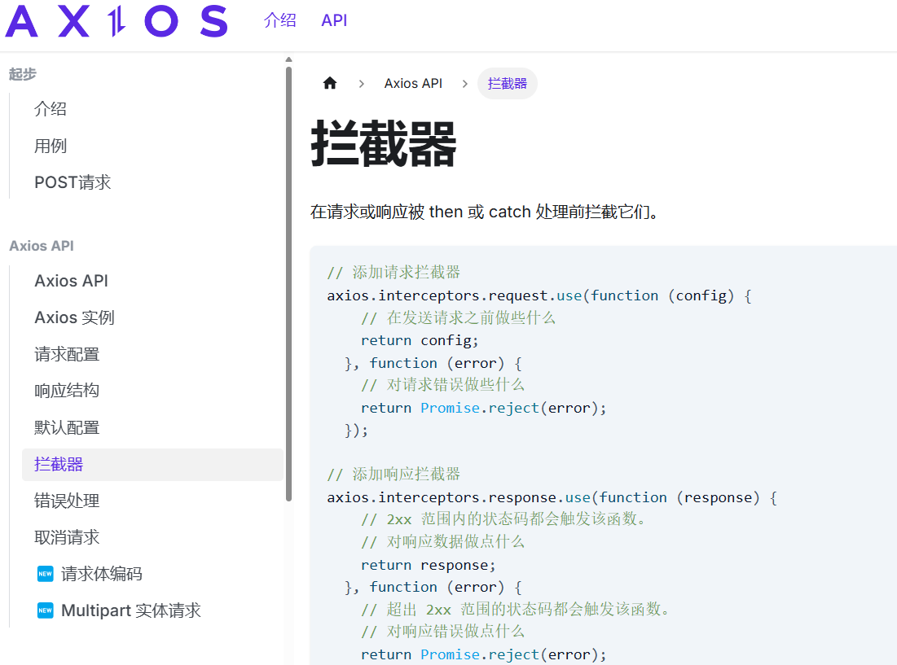

### 编程式导航 - name 命名路由跳转传参 (动态路由传参)


#### 面经案例（基础版）


步骤：
1. 先配置一级路由：

 

2. 配置二级路由：


3. 导航高亮


4. 通过axios请求得到面经页面的数据并渲染

- 安装axios
>npm i axios --save
- 引入axios
>import axios from 'axios'
- 请求数据


- 保存需要的数据

- 渲染数据


5. 页面跳转并传参
- 刷新页面直接在article界面

- 点击跳转并传参，点击回退

这里我传参 传错了 不能用差值表达式啊兄弟，你这里放的是变量！！！！


6. 接收页收到参数 请求数据 渲染页面
- 收到参数

- 请求数据

- 渲染页面


这里刚开始v-for然后疯狂报错，想起来详情页循环啥哈哈sb
- 这里会有非常明显的加载问题 数据还未加载完就显示了一点 


7. 组件缓存 keep-alive


# 8. 自定义创建项目


## 设置插件报错时手动更改错误


## 设置插件报错时自动更改错误
插件：eslint

```js
// 当保存的时候，eslint自动帮我们修复错误
"editor.codeActionsOnSave": {
    "source.fixAll": true
},
// 保存代码，不自动格式化
"editor.formatOnSave": false
```


# 9. Vuex
Vuex 是一个 Vue 的 状态管理工具，状态就是数据。

大白话：Vuex 是一个插件，可以帮我们管理 Vue 通用的数据 (多组件共享的数据)。例如：购物车数据   个人信息数


官方原文：

- 不是所有的场景都适用于vuex，只有在必要的时候才使用vuex
- 使用了vuex之后，会附加更多的框架中的概念进来，增加了项目的复杂度  （数据的操作更便捷，数据的流动更清晰）

Vuex就像《近视眼镜》, 你自然会知道什么时候需要用它~

还有就是文件误删了就可以再创一次覆盖就好了

## vuex 的使用 - 创建仓库
步骤：
1. 安装vuex
>npm i vuex@3  --legacy-peer-deps

2. 新建`store/index.js` 专门存放 vuex

3. 创建仓库 `store/index.js` 
 ```js
// 导入 vue
import Vue from 'vue'
// 导入 vuex
import Vuex from 'vuex'
// vuex也是vue的插件, 需要use一下, 进行插件的安装初始化
Vue.use(Vuex)

// 创建仓库 store
const store = new Vuex.Store()

// 导出仓库
export default store
 ```

4. 在 main.js 中导入挂载到 Vue 实例上
```js
import Vue from 'vue'
import App from './App.vue'
import store from './store'

Vue.config.productionTip = false

new Vue({
  render: h => h(App),
  store  // 挂载到 Vue 实例上
}).$mount('#app')

```

5. 测试打印Vuex
App.vue
```js
created(){
  console.log(this.$store)
}

```


## 给仓库 提供 数据 state
1. 在store.js中添加共享数据
```js
// 创建仓库 store
const store = new Vuex.Store({
  // state 状态, 即数据, 类似于vue组件中的data,
  // 区别：
  // 1.data 是组件自己的数据, 
  // 2.state 中的数据整个vue项目的组件都能访问到
  state: {
    count: 101
  }
})
```

## 使用 仓库的数据
### 1.使用store直接访问数据


### 2.通过辅助函数访问数据(优化了一下，原理相同)
因为想要简化代码，计算属性可以做到这一点，每次都像这样一个个的提供计算属性, Vuex提供了mapState辅助函数，更方便

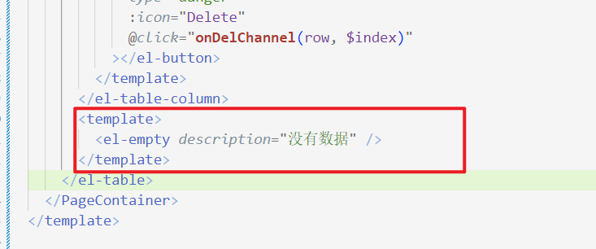
 1. 第一步：导入mapState (mapState是vuex中的一个函数)

```js
import { mapState } from 'vuex'
```

 2. 第二步：采用数组形式引入state属性

```js
mapState(['count']) 
```

> 上面代码的最终得到的是 **类似于**

```js
count () {
    return this.$store.state.count
}
```

 3. 第三步：利用**展开运算符**将导出的状态映射给计算属性

```js
  computed: {
    ...mapState(['count'])
  }
```

```vue
 <div> state的数据：{{ count }}</div>
```

## 2.修改仓库数据 mutations （同步）

vuex遵循单项数据流 ，组件中不能直接修改仓库数据，可以修改，但是若代码多了找不到错 就老实了

### 开启严格模式
`strict: true`


### mutations

### 带参数的 mutations

#### 输入框输入数据，实时输入，实时更新
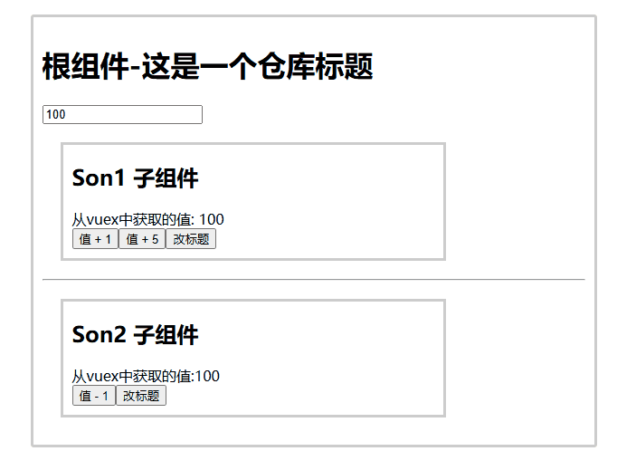
- 这里输入框为什么不用v-model呢
因为v-model可以获取值也可以改变值，但是vuex遵循单项数据流原则，从仓库拿到的数据只能通过 mutations到仓库中改。 
所以将v-model拆分成:value（视图→值）和@input（值→视图）。 


### 辅助函数 mapMutations

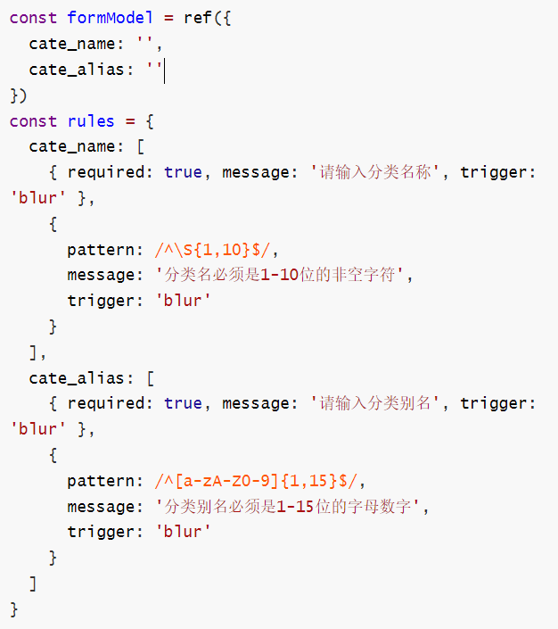

## 3.actions （异步）

state是存放数据的，mutations是同步更新数据 (便于监测数据的变化, 更新视图等, 方便于调试工具查看变化)，

actions则负责进行异步操作，组件中通过dispatch调用函数

### 通过actions一秒后修改数据的值


### 辅助函数 mapActions


## 4.getters 


## 小结


# 模块 module (进阶语法)


## 创建模块
步骤：
1. 在 store 目录下创建 modules 目录 存放模块文件

2. 编写模块文件，并导出

3. 在 store/index.js 中导入模块，并注册到 store 中

4. 在浏览器中使用vuetools查看  

老师是这样的：

我是这样的：


## 1.state访问模块中的数据
### 1.2 直接通过模块名访问
`$store.state.模块名.xxx`
### 1.3 通过mapState映射 开启命名空间
- 默认根级别的映射 mapState([ 'xxx' ])
- 子模块的映射 ：mapState('模块名', ['xxx'])  需要开启命名空间 namespaced:true


## 2.getters获取模块内的数据
### 2.2 直接通过模块名访问


### 2.3 通过mapGetters映射 开启命名空间


## 3.mutations修改模块内的数据
**注意：默认模块中的 mutation 和 actions 会被挂载到全局，需要开启命名空间，才会挂载到子模块。**

### 3.1 直接通过模块名访问 开启命名空间


### 3.2 通过mapMutations映射 开启命名空间


## 4.actions异步修改模块内的数据

### 4.1 直接通过模块名访问 开启命名空间

### 4.2 通过mapActions映射 开启命名空间


## 购物车案例
步骤：

1. 新建项目

Vuex是为了更方便的增删改查数据，不用再父传子子传父。它就是这个模块公用的仓库，大家都可以访问。

2. 将老师准备的src的所以文件copy到自己的src下（清空自己的src）


3. 构建 cart 购物车模块并挂载到 vuex 仓库上


**<span style="color:red">牛逼给牛逼开门，牛逼到家的操作来了！！！！</span>**
4. 基于 json-server 工具，准备后端接口服务环境

**只需要自己写一个json文件，里面放数据，然后这工具就可以模拟后端接口了！！！！**

- 安装全局工具 json-server （全局工具仅需要安装一次）
>npm install -g json-server 
- 代码根目录新建一个 db 目录 存放名为 index.json 的数据文件

这个数据可以自己写！

- 进入 db 目录，执行命令，启动后端接口服务
>json-server --watch index.json


**这里不能关！否则就访问不了数据了**
- 复制上方的链接，在浏览器中打开，即可看到数据


5. 请求获取数据存入 vuex, 映射渲染

- 安装axios
>npm i axios --save

报错的话就：
>npm install --save axios -dev --force

- 拿到数据，存到vuex中


- 渲染页面

通过mapState映射拿到数据


6. 修改商品数量 
注意：前端 vuex 数据，后端数据库数据都要更新
- 点击按钮修改后台数据

同步到后台要刷新才会+1，每次刷新才会请求一下数据更新（应该是这样的

- 同步到vuex


find()是数组的一个方法，它会遍历数组中的每个元素,如果找到匹配的元素，find 方法立即返回这个元素。这里返回id为某值的对象

7. 更新底部数量


getters相当于computed但只能get不能set，所以这里直接拿到state里面的list进行计算就可以啦。算是最轻松的模块了o(╥﹏╥)o

## 移动端电商购物


步骤：
### 1. 项目创建目录初始化
- vue-cli 建项目 


我的项目：E:\vueProject\day08-day10-智慧商城项目\vue2-my-shopping

### 2. 调整初始化目录结构
目标:

1. 删除初始化的一些默认文件
2. 修改没删除的文件
3. 新增我们需要的目录结构
- src/api 目录
  - 存储接口模块 (发送ajax请求接口的模块)
- src/utils 目录
  - 存储一些工具模块 (自己封装的方法)
  

### 3.vant组件库 !
简直是救星啊！！！


>组件库：第三方封装好了很多很多的组件，整合到一起就是一个组件库。
https://youzan.github.io/vant/v2/#/zh-CN/

组件库并不是唯一的，常用的组件库还有以下几种：
pc:  [element-ui](https://element.eleme.cn/#/zh-CN)    [element-plus](https://element-plus.gitee.io/zh-CN/)  [iview](https://iview.github.io/)      **[ant-design](https://antdv.com/components/overview-cn)**

移动：[vant-ui](https://vant-contrib.gitee.io/vant/v2/#/zh-CN/)     [Mint UI](http://mint-ui.github.io/docs/#/zh-cn2) (饿了么)    [Cube UI](https://didi.github.io/cube-ui/#/zh-CN/) (滴滴)

- 组件库的全部导入和按需导入

区别：

1.全部导入会引起项目打包后的体积变大，进而影响用户访问网站的性能

2.按需导入只会导入你使用的组件，进而节约了资源

#### 演示全部导入
**vant-ui提供了很多的组件，全部导入，会导致项目打包变得很大。**
步骤： 
1. 安装vant-ui
>npm i vant@latest-v2 -S

在安装Vant组件库时遇到npm ERR! code ERESOLVE错误，可能由于npm版本不兼容导致。解决方案包括添加--legacy-peer-deps标志或使用--force选项。建议首先尝试使用--legacy-peer-deps，若无效再使用--force。这两种方法通常都能成功安装Vant。
               
原文链接：https://blog.csdn.net/qq_57587705/article/details/124667994

2. 在main.js中
```js
import Vant from 'vant';
import 'vant/lib/index.css';
// 插件安装初始化：内部会将所有的vant组件进行导入注册
Vue.use(Vant)
```

3. 在组件中使用


#### 按需导入（常用）
1. 安装vant-ui（同上）
2. 安装一个插件
>npm i babel-plugin-import -D

报错了然后依旧加上--legacy-peer-deps就可以了
3.  对于使用 babel7 的用户，可以在 babel.config.js 中配置


4. 导入组件就不写在main.js里面了，在utils目录下新建vant-ui.js


### 4.实现vw适配
主要适应移动端不同屏幕的宽度，不用我们手动计算尺寸

官网：https://youzan.github.io/vant/v2/#/zh-CN/advanced-usage

1. 安装插件
>npm install postcss-px-to-viewport@1.1.1 -D --legacy-peer-deps
2. 根目录下新建postcss的配置文件`postcss.config.js`


自行转换了


### 5.配置一二级路由

1. 先配置一级路由，存放至**views**目录下，这里不要直接写文件了，应该用文件夹，方便管理模块数据（？怎么说来着）
这里放一级路由不要放错了兄弟！！！要放在views里面啊啊啊啊


2. 将路由挂载到index.js上


3. 配置二级路由


4. 导入vant插件 实现一级路由跳转至二级路由

- 修改tabbar样式
查看官方文档icon,老师这里只修改了o前面的单词，，，我没找到对应图标


看清楚不是放在里面的小项里，是放在大的里。。。。


- 点击tabbar切换路由 实现点击即高亮


真别太眼瞎好吗？？？？上面route也要加上啊


### 6.登录页静态布局
- 准备工作
1. 新建  `styles/common.less` 重置默认样式
```js
// 重置默认样式
* {
  margin: 0;
  padding: 0;
  box-sizing: border-box;
}

// 文字溢出省略号
.text-ellipsis-2 {
  overflow: hidden;
  -webkit-line-clamp: 2;
  text-overflow: ellipsis;
  display: -webkit-box;
  -webkit-box-orient: vertical;
}

```
2. main.js 中导入应用
```js
import '@/styles/common.less'
```
3.  将准备好的一些图片素材拷贝到 assets 目录【备用】


4. 登录静态布局


- 先实现顶部标题，通过vant组件实现,可以返回上一页


- html代码实现登录界面

```html
<template>
  <div>
    <van-nav-bar
     title="会员登录"
     left-arrow
      @click-left="$router.back()"
    />
    <div class="main">
      <div class="title">
        <h2>手机号登录</h2>
        <span>未注册的手机号登录后将自动注册</span>
      </div>
      <div class="form">
        <div class="form-item">
          <input type="text" maxlength="11"  placeholder="请输入手机号码">
        </div>
        <div class="form-item">
          <input type="text" maxlength="5" placeholder="请输入图形验证码">
          <!-- 图片这里再src目录下的一定要用@ 不然看不到图 -->
          
        </div>
        <div class="form-item">
          <input type="text" placeholder="请输入短信验证码">
          <span>获取验证码</span>
        </div>
      </div>
      <div class="login-btn">
        <button>
          登录
        </button>
      </div>
    </div>
  </div>
</template>
```
```js
<script>
export default {
  name: 'LoginPage'
}
</script>

<style lang="less" scoped>
.main{
  width: 85%;
  margin:30px auto;
  .title{
    h2{
      font-weight: normal;
      margin-block: 8px;
    }
    span{
      color: #ccc;
      font-size: 14px;
    }

  }
  .form{
    margin-top: 30px;
    .form-item{
      // position: relative;
      display: flex;
      justify-content: space-between;

      height: 50px;
      margin-bottom: 10px;
      width: 100%;
      border-bottom: 1px solid #e0dcdc;
      input{
        border: none;
        line-height: 45px;
        font-size: 14px;
      }
      img{
        // position: absolute;
        // top:3px;
        // right: 0;
        width: 100px;
        height: 35px;
      }
      span{
        // position: absolute;
        // top:10px;
        // right: 0;
        color:rgb(242, 168, 45) ;
        font-size: 13px;
      }
    }
  }
  .login-btn{
    margin-top:30px;
    button{
      width: 100%;
      height: 40px;
      border-radius: 25px;
      border: none;
      color: white;
      background-color: rgb(242, 168, 45);
    }
  }
}
</style>

```

### 7.登录页发送数据请求

1. request模块 - axios 封装
目标：将 axios 请求方法，封装到 request 模块

使用 axios 来请求后端接口, 一般都会对 axios 进行 一些配置 (比如: 配置基础地址，请求响应拦截器等)

所以项目开发中, 都会对 axios 进行基本的二次封装, 单独封装到一个 request 模块中, 便于维护使用


接口文档地址：
https://apifox.com/apidoc/shared-12ab6b18-adc2-444c-ad11-0e60f5693f66/doc-2221080
基地址：
http://cba.itlike.com/public/index.php?s=/api/
axios官网：https://www.axios-http.cn/


1.1 安装axios
>npm i axios --save --legacy-peer-deps

1.2 建utils/request.js 
 - 创建axios实例instance,将来对创建出来的实例，进行自定义配置
 好处：不会污染原始的axios实例
    
    （图见axios官方文档）

- 自定义配置（配置请求响应拦截器）

还需要修改一些地方

- 导出配置好的实例


- 测试

成功


2. 发送请求拿到验证码的图片 


- 点击刷新的功能！ 就是重新调用请求函数一次（怪不得封装成函数了）


3. api接口模块 -封装图片验证码接口
在登录页中，我们会请求多个接口（验证码接口图片、登录接口、获取验证码接口）太多请求可能存在复用的情况，写在一个页面里也太杂乱了

所以我们在api文件夹下面建立专门存放登录相关请求的接口就好啦


- 新建 `api/login.js` 提供获取图形验证码 Api 函数


4. toast 轻提示（vant组件）
https://youzan.github.io/vant/v2/#/zh-CN/toast


这里就直接使用挂到原型身上那个方法的，不用按需导入那行代码


但要在非组件上使用就必须先导入再使用了，比如我们在mian.js里面写一个toast 这样一进页面就会显示这条消息


5. 短信验证倒计时功能

####  倒计时基础效果
1. 准备 data 数据

```jsx
data () {
  return {
    totalSecond: 60, // 总秒数
    second: 60, // 倒计时的秒数
    timer: null // 定时器 id
  }
},
```

2. 给按钮注册点击事件

```jsx
<button @click="getCode">
  {{ second === totalSecond ? '获取验证码' : second + `秒后重新发送`}}
</button>
```

3. 开启倒计时时

```jsx
async getCode () {
  if (!this.timer && this.second === this.totalSecond) {
    // 节流：在定时器都关着，且总秒和当前秒一致的情况下，才开始计时
    this.timer = setInterval(() => {
      this.second--

      if (this.second < 1) {
        clearInterval(this.timer)
        this.timer = null
        this.second = this.totalSecond
      }
    }, 1000)
  }
}
```

4. 离开页面销毁定时器

```jsx
destroyed () {
  clearInterval(this.timer)
}
```

#### 验证码请求校验处理

1. 输入框 v-model 绑定变量

```jsx
data () {
  return {
    mobile: '', // 手机号
    picCode: '' // 图形验证码
  }
},
    
<input v-model="mobile" class="inp" maxlength="11" placeholder="请输入手机号码" type="text">
<input v-model="picCode" class="inp" maxlength="5" placeholder="请输入图形验证码" type="text">
```

2. methods中封装校验方法

```jsx
// 校验输入框内容
validFn () {
  if (!/^1[3-9]\d{9}$/.test(this.mobile)) {
    this.$toast('请输入正确的手机号')
    return false
  }
  if (!/^\w{4}$/.test(this.picCode)) {
    this.$toast('请输入正确的图形验证码')
    return false
  }
  return true
},
```

3. 请求倒计时前进行校验

```jsx
// 获取短信验证码
  getCode () {
  if (!this.validFn()) {
    return
  }
  ...
}
```

####  封装接口，请求获取验证码

1. 封装接口 `api/login.js`

```jsx
// 获取短信验证码
export const getMsgCode = (captchaCode, captchaKey, mobile) => {
  return request.post('/captcha/sendSmsCaptcha', {
    form: {
      captchaCode,
      captchaKey,
      mobile
    }
  })
}
```

2. 调用接口，添加提示

```jsx
// 获取短信验证码
async getCode () {
  if (!this.validFn()) {
    return
  }

  if (!this.timer && this.second === this.totalSecond) {
    // 发送请求，获取验证码
    await getMsgCode(this.picCode, this.picKey, this.mobile)
    this.$toast('发送成功，请注意查收')
    
    // 开启倒计时
    ...
  }
}
```
#### 封装api接口 - 登录功能

`api/login.js` 提供登录 Api 函数

```jsx
// 验证码登录
export const codeLogin = (mobile, smsCode) => {
  return request.post('/passport/login', {
    form: {
      isParty: false,
      mobile,
      partyData: {},
      smsCode
    }
  })
}
```

`login/index.vue` 登录功能

```jsx
<input class="inp" v-model="msgCode" maxlength="6" placeholder="请输入短信验证码" type="text">
<div class="login-btn" @click="login">登录</div>

data () {
  return {
    msgCode: '',
  }
},
methods: {
  async login () {
    if (!this.validFn()) {
      return
    }
   // if (!/^\d{6}$/.test(this.msgCode)) {
  //    this.$toast('请输入正确的手机验证码')
   //   return
    //}
    await codeLogin(this.mobile, this.msgCode)
    this.$router.push('/')
    this.$toast('登录成功')
  }
}
```


#### 响应拦截器统一处理错误提示
刚才的验证图形验证码以及短信验证码都是在假设正确的情况下发起请求的。
通过响应拦截器可以抛出错误提示

但是这里老师给的接口好像输什么都是返回200，所以我这里只是执行了代码，但实际并未生效。

...生效了


登录成功之后返回的token和userId需要存储到vuex


#### 将登录权证信息存入 vuex


上面这两处错了


输入正确信息点击登录之后


存入vuex里面的数据哈哈刷新就无了，任何数据都是这样的
所以！我们一定要本地化存储数据啊！

#### vuex持久化处理


这里涉及到用户数据信息，那么本地存储的键名不能太简单，每次从复杂数据类型转化到json数据类型，再。。。。很麻烦，so我们封装成函数，到时候直接调用

这里在`utils`目录下写`storage.js` 封装方法


#### 优化：添加请求 loading 效果


太抽象了，，，我怎么会知道是在响应拦截器中写loadding.....


### 8.登录访问拦截 - 路由前置守卫

目标：基于全局前置守卫，进行页面访问拦截处理**

说明：智慧商城项目，大部分页面，游客都可以直接访问, 如遇到需要登录才能进行的操作，提示并跳转到登录

但是：对于支付页，订单页等，必须是登录的用户才能访问的，游客不能进入该页面，需要做拦截处理


1.所有的路由一旦被匹配到，都会先经过全局前置守卫

2.只有全局前置守卫放行，才会真正解析渲染组件，才能看到页面内容

```jsx
router.beforeEach((to, from, next) => {
// 所有的路由在真正被访问到之前（解析渲染对应组件页面前），都会经过全局前置守卫
// 只有全局前置守卫放行了，才会到达对应的页面

// 全局前置导航守卫
// to:   去哪里，哪里的完整路由信息对象（路径，参数）
// from: 从哪儿来，来时的完整路由信息对象（路径，参数）
// next(): 是否放行
//  1.next() : 直接放行，放行到to要去的路径
//  2.next(路径) 进行拦截，拦截到next里面的路径去
  console.log(to, from, next)
})
```


我要哭了，，，我已经完全混乱了，，，，


### 9.首页

#### 9.1 静态页面布置
1. 静态结构和样式 `layout/home.vue`

```jsx
<template>
  <div class="home">
    <!-- 导航条 -->
    <van-nav-bar title="智慧商城" fixed />

    <!-- 搜索框 -->
    <van-search
      readonly
      shape="round"
      background="#f1f1f2"
      placeholder="请在此输入搜索关键词"
      @click="$router.push('/search')"
    />

    <!-- 轮播图 -->
    <van-swipe class="my-swipe" :autoplay="3000" indicator-color="white">
      <van-swipe-item>
        
      </van-swipe-item>
      <van-swipe-item>
        
      </van-swipe-item>
      <van-swipe-item>
        
      </van-swipe-item>
    </van-swipe>

    <!-- 导航 -->
    <van-grid column-num="5" icon-size="40">
      <van-grid-item
        v-for="item in 10" :key="item"
        icon="http://cba.itlike.com/public/uploads/10001/20230320/58a7c1f62df4cb1eb47fe83ff0e566e6.png"
        text="新品首发"
        @click="$router.push('/category')"
      />
    </van-grid>

    <!-- 主会场 -->
    <div class="main">
      
    </div>

    <!-- 猜你喜欢 -->
    <div class="guess">
      <p class="guess-title">—— 猜你喜欢 ——</p>

      <div class="goods-list">
        <GoodsItem v-for="item in 10" :key="item"></GoodsItem>
      </div>
    </div>
  </div>
</template>

<script>
import GoodsItem from '@/components/GoodsItem.vue'
export default {
  name: 'HomePage',
  components: {
    GoodsItem
  }
}
</script>

<style lang="less" scoped>
// 主题 padding
.home {
  padding-top: 100px;
  padding-bottom: 50px;
}

// 导航条样式定制
.van-nav-bar {
  z-index: 999;
  background-color: #c21401;
  ::v-deep .van-nav-bar__title {
    color: #fff;
  }
}

// 搜索框样式定制
.van-search {
  position: fixed;
  width: 100%;
  top: 46px;
  z-index: 999;
}

// 分类导航部分
.my-swipe .van-swipe-item {
  height: 185px;
  color: #fff;
  font-size: 20px;
  text-align: center;
  background-color: #39a9ed;
}
.my-swipe .van-swipe-item img {
  width: 100%;
  height: 185px;
}

// 主会场
.main img {
  display: block;
  width: 100%;
}

// 猜你喜欢
.guess .guess-title {
  height: 40px;
  line-height: 40px;
  text-align: center;
}

// 商品样式
.goods-list {
  background-color: #f6f6f6;
}
</style>
```

2. 新建`components/GoodsItem.vue`

```jsx
<template>
  <div class="goods-item" @click="$router.push('/prodetail')">
    <div class="left">
      
    </div>
    <div class="right">
      <p class="tit text-ellipsis-2">
        三星手机 SAMSUNG Galaxy S23 8GB+256GB 超视觉夜拍系统 超清夜景 悠雾紫
        5G手机 游戏拍照旗舰机s23
      </p>
      <p class="count">已售104件</p>
      <p class="price">
        <span class="new">¥3999.00</span>
        <span class="old">¥6699.00</span>
      </p>
    </div>
  </div>
</template>

<script>
export default {}
</script>

<style lang="less" scoped>
.goods-item {
  height: 148px;
  margin-bottom: 6px;
  padding: 10px;
  background-color: #fff;
  display: flex;
  .left {
    width: 127px;
    img {
      display: block;
      width: 100%;
    }
  }
  .right {
    flex: 1;
    font-size: 14px;
    line-height: 1.3;
    padding: 10px;
    display: flex;
    flex-direction: column;
    justify-content: space-evenly;

    .count {
      color: #999;
      font-size: 12px;
    }
    .price {
      color: #999;
      font-size: 16px;
      .new {
        color: #f03c3c;
        margin-right: 10px;
      }
      .old {
        text-decoration: line-through;
        font-size: 12px;
      }
    }
  }
}
</style>

```

3. 组件按需引入

```jsx
import { Search, Swipe, SwipeItem, Grid, GridItem } from 'vant'

Vue.use(GridItem)
Vue.use(Search)
Vue.use(Swipe)
Vue.use(SwipeItem)
Vue.use(Grid)
```

#### 9.2 封装接口 发送数据请求

1. 封装首页请求数据模块 `api/home.js`

2. `home.vue`请求数据


#### 9.3 拿到数据 渲染首页

1. 先渲染轮播图


2. 渲染导航、猜你喜欢


猜你喜欢要用到父传子！！！


### 10. 搜索界面 （首页点击搜索）

1. 静态页面布置
2. 搜索历史基本渲染
3. 添加历史 搜索框添加 前置点击的搜索记录


4. 清空历史记录

5. 持久化存储


6. 点击搜索跳转到搜索列表页


#### 10.1 搜索列表页

1. 静态页面布置
2. 拿到搜索界面传过来的参数

3. 封装搜索页拿数据的方法于 api/searchlist.js 接口

4. 在页面中获取数据并渲染


### 11. 分类页
 1. 静态页面布置
 
    
    
    
    

 2. 封装接口 `api/category.js`

3. 拿到数据并渲染 见1
4. 跳转传参并在serchlist界面接收参数


### 12. 商品详情页
1. 静态页面布置

2. 封装接口 `api/product.js`
3. 拿到数据并渲染

4. 跳转传参并在serchlist界面接收参数


#### 9.8 商品详情页-加入购物车弹窗
1. 导入vant组件 ActionSheet 动作面板

2. 按钮控制组件的显示
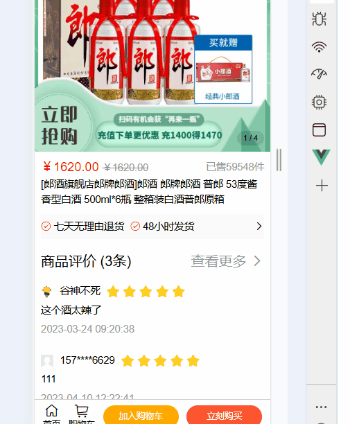

3. 完善弹层内容及样式


4. 添加新的组件来封装加减框
- 利用父传子将原始个数传给儿子
- 子传父 修改父亲数据

上图有bug如果里面直接放参数1/-1后面点击

- 子传父 修改输入框数据并提交


5. 加入购物车 - 判断 token 登录提示

- 引入dialog组件


但是我这里有问题，最开始有个地方 写了未登录直接跳转到登录页面，所以我要是清空登录的情况就直接跳到登录页面了，，，无语

#### 9.9 加入购物车 - 封装接口进行请求
1. 封装接口 `api/cart.js`
2. 页面中调用请求


3. 请求拦截器中，统一携带 token


4. 准备小图标


### 13. 购物车页面
1. 静态布局 导入组件(vant的复选框、CountBox组件)
2. 构建vuex模块-获取数据存储

- 新建仓库 sotre/modules/cart.js

- 将其挂载到 sotre/index.js中


3. 封装API接口拿到数据


4. 在vuex中保存数据

5. 在页面中dispath调用仓库中数据


6. 渲染页面

为啥？


7. 计算数量和价格 在getters里计算


8. 实现复选框点击和取反操作
这里的复选框是从仓库中拿到的，所以要修改状态要去仓库
- 小复选框的选中和取反


- 点击小选控制全选


- 大复选框控制小复选框


9. 实现选择框的数量选择 后台和vuex的同步

- 封装API接口拿到数据

- 点击增减使得后台商品数据能同步改变
@input后面俩参数是找到对应的商品然后修改

- 仓库修改数据


实现了但是我无穷懵逼

10. 实现点击编辑删除商品
- 点击编辑 结算转为删除

- 点击编辑时 修改复选框的状态

- 封装api删除数据的接口

- 在页面中调用 提交到仓库中修改


- 在仓库中可同时将后台数据页修改了

这里优化了一下...


11. 购物车为空时，更改界面样式


### 14. 订单结算页

1. 静态界面布局
2. 封装API接口拿到数据 新建`api/address.js`


3. 在页面中调用函数（pay.vue）

4. 渲染页面 但是这里 我没有任何地址数据
。。。。然后非常麻烦 就先不做了。。。

5. 提交订单并支付
5.1 购物车界面支付
- 封装API接口

- cart.vue页面点击结算按钮时传参

别忘记吧selCartList拿过来


- 在pay.vue页面中调用接口


- 在页面中渲染商品


5.2 订单详情页直接支付
- 接口已封装
- ProDetail.vue 详情页调用接口
点击按钮跳转界面，传参


- 点击按钮前 判断是否登录
通过minixs复用 任意组件通用minixs里面的方法/数据
通过导包引入即可直接调用里面的数据


### 15.订单管理界面（支付成功之后的界面）
1. 静态布局
2. 封装api接口


3. 在页面中调用接口函数 渲染页面


### 16. 个人中心 界面
1. 静态布局

2. 封装api接口 调用接口

3. 渲染页面

4. 实现退出登录功能


### TMD 打包!!!!!!


- `npm run build`

终端输入命令之后  会出现dist文件夹


格式化`Ctrl + K, Ctrl + F`


再重新打包一下


### 路由懶加載
路由懒加载 & 异步组件， 不会一上来就将所有的组件都加载，而是访问到对应的路由了，才加载解析这个路由对应的所有组件

官网链接：https://router.vuejs.org/zh/guide/advanced/lazy-loading.html#%E4%BD%BF%E7%94%A8-webpack

> 当打包构建应用时，JavaScript 包会变得非常大，影响页面加载。如果我们能把不同路由对应的组件分割成不同的代码块，然后当路由被访问的时候才加载对应组件，这样就更加高效了。


# assets

## 优势：
1. 更容易维护

- assets:组合式API（vue2:选项式API）

- 更好的TS支持

2. 更快的速度：

- 重新diff算法
- 模版编译优化
- 更高效的组件初始化

3. 更小的体积

- 良好的TreeShaking
- 按需引入

4. 更优的数据响应式

- Proxy

## 使用create-vue搭建Vue3项目

vue cli底层是webpack，这个创建的底层是vite，速度更快。

步骤：
1. 查看前提环境条件`node -v`
安装16.0以上的Node.js


2. `npm init vue@latest`创建Vue应用


3. `npm run dev`运行项目


## 关键文件：

- App.vue
script中加上setup允许在script中直接编写组合式API


- main.js 和 index.html

## 插件安装：


启用vue-official


## 组合式API

### setup语法糖


### reactive和ref函数
- reactive:接收对象类型的参数传入，返回一个响应式的对象

- ref（常用）:接受对象类型和普通数据类型，返回响应式对象 

- 使用：先导入后使用


### computed计算属性
- 使用：先导入后使用

```js
<script setup>
import {ref,computed} from 'vue'
// 1. 声明数据
const list = ref([1,5,4,8,15,10,20,88])
// 2.基于list派生一个计算属性
const comutedList = computed(() =>{
  return list.value.filter(item => item > 10)
})
// 3.添加随机数 向下取整
const addOne = () =>{
  list.value.push(Math.floor(Math.random() * 100))

}
</script>

<template>
  <div>原始数据：{{ list }}</div>
  <div>计算之后：{{ comutedList }}</div>
  <button @click="addOne">添加</button>
</template>
```
### watch监听器
`watch(ref对象,(newValue,oldValue) => {...})`
`watch([ref对象],(newValue,oldValue) => {...})`


- 其他配置项

- immediate

- deep


- 监听对象指定属性的变化


### 生命周期函数


### 父传子`defineProps`编译器宏


带冒号是因为值要用到变量

### 子传父`emit`编译器宏


### 模版引用 ref标识获取dom对象或组件实例对象
- 获取dom对象


- 获取组件实例对象

一定要暴露给父组件 才可以调用


### 组合式API - provide和inject
顶层组件向任意的底层组件传递数据和方法，实现跨层组件通信


### assets.3新特性-defineOptions

解决平级属性不用再开一个script另写的状态


### assets.3新特性-defineModel


## Pinia 快速入门


步骤：
1. 新建项目
`npm create vue@latest`

`npm i`安装环境依赖

`npm run dev `运行

2. 安装pinia （可见官方文档）
` npm install pinia`


3. 创建store文件(命名:use名字Store) 声明数据 state


4. 声明操作数据的方法 普通函数 =  action


5. 声明基于数据派生的计算属性 computed =  getters


6. 异步操作


7. 解构
直接解构是不行的，会造成数据丢失相应。为了保证数据响应，方法如下：
- 对于getters和state 解构时要加函数 storeToRefs

- 对于actions 直接解构


8. Pinia持久化

官方文档：https://prazdevs.github.io/pinia-plugin-persistedstate/zh/

不用自己封装localstorage，直接安装持久化存储的插件

8.1 `npm i pinia-plugin-persistedstate`

8.2 将插件添加到你的 pinia 实例中：
这里我添加到了main.js


8.3 在组件中的用法：
声明store时，请将新persist选项设置为 true

重启项目，完成持久化存储

8.4 修改配置项
- 修改存储时的名字（键名）key


- 指定数据持久化存储 pick
它默认所有数据持久化，上图只有count变了，所以我们让count持久化


# assets 大事件管理系统


## 新的包管理器pnpm


## 1.pnpm创建项目

- 进入终端
 在这里cmd进入，
- 输入命令
`npm install -g pnpm` 全局安装pnpm包
`pnpm create vue` 创建项目

进入项目之后
`pnpm install` 安装依赖
`pnpm dev` 运行项目


## 2.Eslint 配置代码风格
Eslint校验错误，prettier美化（格式化提高代码美观度）
- 配置Eslint的前置条件
1. 禁用格式化插件 prettier 
2. 安装Eslint插件，并配置保存时自动修复（设置中）


### 2.1 添加新的Eslint、Prettier规则
```js
 rules: {
  // prettire 美化
    'prettier/prettier': [
      'warn',
      {
        singleQuote: true, // 单引号
        semi: false, // 无分号
        printWidth: 80, // 每行宽度至多80字符
        trailingComma: 'none', // 不加对象|数组最后逗号
        endOfLine: 'auto' // 换行符号不限制（win mac 不一致）
      }
    ],
    'vue/multi-word-component-names': [
      'warn',
      {
        ignores: ['index'] // vue组件名称多单词组成（忽略index.vue）
      }
    ],
    // Eslint规则
    'vue/no-setup-props-destructure': ['off'], // 关闭 props 解构的校验
    // 💡 添加未定义变量错误提示，create-vue@3.6.3 关闭，这里加上是为了支持下一个章节演示。
    'no-undef': 'error'
  }
```


## 3.配置代码检查工作流（基于husky的代码检查工作流）
husky是一个**git hooks**工具( git的钩子工具，可以在特定时机执行特定的命令 )

- 打开终端 选择git base

- `git init`初始化git仓库
- ` pnpm dlx husky-init && pnpm install`安装husky工具配置
- 修改`pre-commit`文件内容


- `git add .`暂存
-  `git commit -m '初始化提交测试'`新提交


>pnpm lint 是全量检查，耗时长，历史遗留问题影响接下来的代码和数据的提交

安装lit-staged配置解决上诉问题：
忽略历史遗留的Eslint错误，执行本次编写的代码
- `pnpm i lint-staged -D` 安装
- 配置`package.json`

- 修改 ` .husky/pre-commit `文件


## 4.目录调整
删除不需要的文件，添加api（异步请求）和utils（工具）文件夹


提交


## 5.vue-router4 路由代码解析
import.meta.env.BASE_URL 是Vite 环境变量：[https://cn.vitejs.dev/guide/env-and-mode.html](https://cn.vitejs.dev/guide/env-and-mode.html)


- 路由跳转


## 6.引入 element-ui 组件库
**官方文档：** https://element-plus.org/zh-CN/

- `pnpm install element-plus` 安装

- `pnpm add -D unplugin-vue-components unplugin-auto-import` 按需导入 自动导入

- 配置`vite.config.ts`


- 直接使用，牛逼，不用导入。包括自己在components里面建立的组件也不用导入


## 7.Pinia - 构建用户仓库 和 持久化

持久化存储：
官方文档：https://prazdevs.github.io/pinia-plugin-persistedstate/zh/
-D，存当前这个文件里，-g，是存电脑里，所有文件都能用


- Pinia的独立维护
在store文件夹下新建`index.js`文件让pinia初始化 分离出main.js中初始化pinia的模块


- 仓库统一导出


## 8.数据交互 - 请求工具设计

- axios官网
https://www.axios-http.cn/docs/intro
跟着官网完成axios配置
- 安装axios `pnpm add axios`
- 创建axios实例（新建utils/requst.js）

 -- 配置基地址和相应时间
 

- 配置拦截器

 -- 配置请求拦截器 
 请求到服务器前加上需携带的token
 
- 配置响应拦截器 结合Elmentui 弹出错误提示


可选链操作符 ?.，如果 err 或 err.response 是 undefined 或 null，表达式将立即返回 undefined,这避免了在尝试访问一个不存在的属性时程序崩溃。

useRouter 是专门为setup函数设计的获取路由对象的方法
**艹tmd就是这里下面应该用自己实例化的axios发送请求拦截！！！！不然拿不到数据啊啊啊我以为接口错了艹！！！！！！！！！！！！！！！！！！！！！！！！！！！！！！！！！！！！！！！！！！！！！！！！！！！！！！！！！！！！！！！！！！！！！！！！！！！！！！！！！！！！！！！！！！！！！！！！！！！！！！！！妈的**


## 9. 整体路由设计


- 在`views`文件夹下新建页面文件


layout页面和app.vue页面需要配置路由出口`router-view`

- 在`router`文件夹下的`index.js`中编写路由路径，用路由懒加载的形式配置


- 提交配置路由


## 10.开启业务开发-- 登录注册页面

### 10.1 静态页面


用elmetn解决这个页面


使用elmentui的icon图片
- 安装包管理器
`pnpm install @element-plus/icons-vue`
- 使用时导包
`import { User, Lock } from '@element-plus/icons-vue'`

`<el-input :prefix-icon="User">`


### 10.2 注册功能校验

- 看element文档


- model 属性绑定 form 数据对象
 
  
1. 结合接口拿过来的数据配置绑定的数据对象
```js
const formModel = ref({
  username: '',
  password: '',
  repassword: ''
})

<el-form :model="formModel" >
```
2. v-model 绑定 form 数据对象的子属性
```js
<el-input
  v-model="formModel.username"
  :prefix-icon="User"
  placeholder="请输入用户名"
></el-input>
... 
(其他两个也要绑定)
```

3. rules 配置校验规则
非空校验、长度校验、正则校验、自定义校验


```js
<el-form :rules="rules" >
    
const rules = {
  username: [
    { required: true, message: '请输入用户名', trigger: 'blur' },
    { min: 5, max: 10, message: '用户名必须是5-10位的字符', trigger: 'blur' }
  ],
  password: [
    { required: true, message: '请输入密码', trigger: 'blur' },
    {
      pattern: /^\S{6,15}$/,
      message: '密码必须是6-15位的非空字符',
      trigger: 'blur'
    }
  ],
  repassword: [
    { required: true, message: '请再次输入密码', trigger: 'blur' },
    {
      pattern: /^\S{6,15}$/,
      message: '密码必须是6-15的非空字符',
      trigger: 'blur'
    },
    {
      validator: (rule, value, callback) => {
        if (value !== formModel.value.password) {
          callback(new Error('两次输入密码不一致!'))
        } else {
          callback()
        }
      },
      trigger: 'blur'
    }
  ]
}
```

### 10.3 提交注册表前预校验表单


需求：封装注册api，进行注册，注册成功切换到登录

1. 新建 api/user.js 封装

```jsx
import request from '@/utils/request'

export const userRegisterService = ({ username, password, repassword }) =>
  request.post('/api/reg', { username, password, repassword })
```

2. 页面中调用

```jsx
const register = async () => {
  await form.value.validate()
  await userRegisterService(formModel.value)
  ElMessage({message:'注册成功',type:'success'})
  // 切换到登录
  isRegister.value = false
}
```

3. eslintrc 中声明全局变量名,  解决 ElMessage 报错问题

```jsx
module.exports = {
  ...
  globals: {
    ElMessage: 'readonly',
    ElMessageBox: 'readonly',
    ElLoading: 'readonly'
  }
}
```


### 10.4 实现登录功能 (校验 + 登录 + 存token)

【需求说明1】登录之前的预校验

- 登录请求之前，需要对用户的输入内容，进行校验
- 校验通过才发送请求

【需求说明2】**登录功能**

1. 封装登录API，点击按钮发送登录请求
2. 登录成功存储token，存入pinia 和 持久化本地storage
3. 跳转到首页，给提示

【测试账号】
- 登录的测试账号:  meinv

- 登录测试密码:  123456


不是哥们，我试那么多次没成功，账号'meinv' 密码 123456 成功了......

**tmd自己先去老师的界面注册啊！！！！！！！！！！**

步骤： 
1.  注册事件，进行登录前的预校验 (获取到组件调用方法)

```jsx
<el-form ref="form">
    
const login = async () => {
  await form.value.validate()
  console.log('开始登录')
}
```

2. 封装接口 API

```jsx
export const userLoginService = ({ username, password }) =>
  request.post('api/login', { username, password })
```

3. 调用方法将 token 存入 pinia 并 自动持久化本地

```jsx
const userStore = useUserStore()
const router = useRouter()
const login = async () => {
  await form.value.validate()
  const res = await userLoginService(formModel.value)
  userStore.setToken(res.data.token)
  ElMessage.success('登录成功')
  router.push('/')
}
```

## 11. 主界面

### 11.1 静态界面搭建
用到elemntui的菜单组件

设置选中后菜单文字颜色
设置 active-text-color 属性，但是必须在需要生效的子菜单中设置index属性，否则不生效，


### 11.2 添加导航守卫
官网：https://router.vuejs.org/zh/guide/


### 11.3 请求数据，渲染界面

- 调用api接口，
- 在Pinia中存储用户信息
- 页面中调用pinia存储的用户信息

我这里一直不行.....前面用aixos实例了吗sb


### 11.4 退出登录，

command参数刚好是跳转路径


## 12.文章分类

### 12.1基本架子 - PageContainer 封装

使用el-card组件

- 封装组件


- 复用组件


### 12.2 文章分类渲染 & loading 处理


没有数据的情况


### 12.3 添加分类和编辑分类
1. 准备弹窗dialog

2. 点击事件

3.  封装弹层组件ChannelEdit

ChannelEdit组件在article的components文件夹下，而不是在src的components下，所以没有彩蛋，需要导入！！


4. 准备弹层表单
- 准备数据 和 校验规则

- 准备表单

- 编辑按钮点击之后的数据回显

open是子组件专门暴露出来为父组件使用的，父组件通过ref绑定子组件之后可以调用子组件的open方法， 进而传值给子组件 让子组件进行渲染


- 基于传过来的表单数据，进行标题控制，有 id 的是编辑


5. 确认提交

- 封装添加和编辑接口

- 确认按钮添加事件 ，单的最后一次统一校验

- 通知父组件回显更新的数据（子传父）


### 12.4 删除分类
- 封装删除接口

- 页面中添加确认框，调用接口进行提示


## 13. 文章管理页面

### 13.1 静态页面搭建
- 搜索表单


- 表格

1. 表格准备，模拟假数据渲染

2. 实现表格


### 13.2 修改elmentui组件语言为中文


### 13.3 文章分类选择框分类

- 这里的选择框会复用，所以封装成一个组件先

- 从接口拿到数据渲染选择框


- 表单实现数据绑定
子组件不能直接使用v-model,要拆分
>vue2中， v-model = :value + @input
**vue3中，v-model = :modelValue + @update:modelValue**

父组件：


子组件：

@update拼错了 密码的

### 13.4 文章列表渲染
- 封装接口拿数据

- 新建 `utils/format.js` 封装格式化日期函数


### 13.5 分页


- 添加loading效果
因为太丝滑了，所以有没更新效果，加个loading弄个样子


### 13.6 搜索功能


这个功能代码简单，但是要理解底层逻辑
搜索框进行了v-model双向数据绑定，表单选中某个数据之后会传值到父元素，父元素的请求参数就跟着改变，所以渲染的数据页直接变。


### 13.7 重置功能


### 13.8 发布文章和编辑按钮
- 使用抽屉组件

- 封装成组件,将数据封装open()暴露出去

- 页面中ref绑定子元素，调用子元素的open()方法 实现抽屉的显示


### 13.9 发布文章详情页

- 上传图片
这里图片点击上传之后，现在本地预览，点击按钮才上传到后端。
用upload组件

关闭 elemnet-plus 的上传（:auto-upload:"false"），不需要配置 action等参数
本地预览语法：URL.createObjectURL(...) 

- 手动上传


- 本地预览图片 `URL.createObjectURL(...) `


- 美化样式
```js
.avatar-uploader {
  :deep() {
    .avatar {
      width: 178px;
      height: 178px;
      display: block;
    }
    .el-upload {
      border: 1px dashed var(--el-border-color);
      border-radius: 6px;
      cursor: pointer;
      position: relative;
      overflow: hidden;
      transition: var(--el-transition-duration-fast);
    }
    .el-upload:hover {
      border-color: var(--el-color-primary);
    }
    .el-icon.avatar-uploader-icon {
      font-size: 28px;
      color: #8c939d;
      width: 178px;
      height: 178px;
      text-align: center;
    }
  }
}
```
当 `style` 标签有 scoped 属性时，它的 CSS 只作用于当前组件中的元素，所以需要deep

### 13.10 富文本编辑器
官网地址：https://vueup.github.io/vue-quill/
使用到 vue-quill-editor
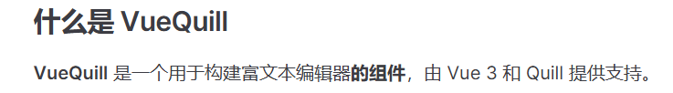
- 安装
`pnpm add @vueup/vue-quill@latest`
- 注册成局部组件
`import { QuillEditor } from '@vueup/vue-quill'`
`import '@vueup/vue-quill/dist/vue-quill.snow.css'`

### 13.11 提交表单(发布和草稿按钮)
- 封装接口

- 注册点击事件调用

- 父组件监听事件，重新渲染

- 添加完成后的内容重置
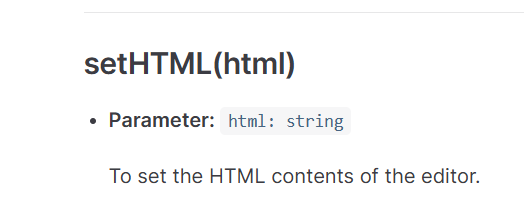


### 13.12 编辑文章时数据回显

- 封装接口

- 页面中调用接口

- 回显

- 这里的图片需要转换成file对象

### 13.13 编辑文章的发布
- 封装接口 调用接口 提交给父组件


## 14.个人中心-基本资料

### 14.1 表单 数据回显
数据是用户信息，已经存在pinia里的，直接调用，这里解构之后直接赋值


### 14.2 点击按钮修改信息


## 15.个人中心-更换头像
- upload组件
- 点击按钮调用upload组件的上传


- 本地显示图片

- 上传图片
 封装的接口，参数是body参数 要用{}阔起来
  Query参数直接使用
  
  这里的参数用的是base64，所以需要：
  